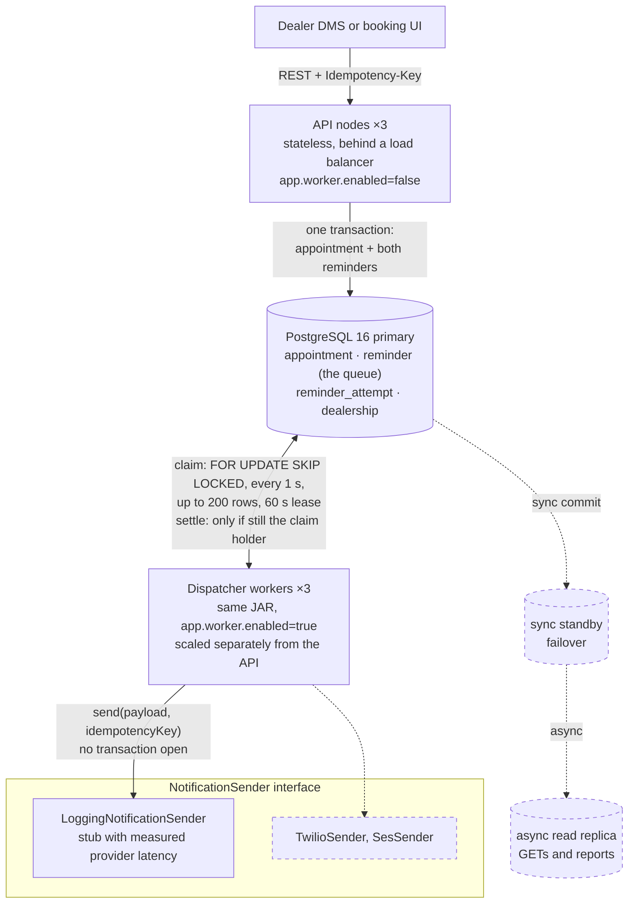

# Appointment booking and reminder service

Books vehicle service appointments and sends each customer two reminders, 24 hours and
2 hours before. The brief's hardest line is *"a customer must never receive the same
reminder twice. Should be provable."* This service enforces that in the database, and you
can check it yourself in under a minute.

Java 25, Spring Boot 4.1, PostgreSQL 16, Flyway, Testcontainers, Micrometer with
Prometheus. 68 tests, every one against a real Postgres.

## How this maps to the brief

| # | The brief asks for | Where it is |
|---|---|---|
| 1, 2 | `POST /appointments` creating an appointment with a time and a customer contact | `POST /v1/appointments`, [run it](#run-it), [API](docs/api.md) |
| 3 | Reminders 24 hours and 2 hours before | Two reminder rows written with every booking, [how it works](#how-it-works) |
| 4 | A stub `NotificationSender` that logs the payload | `LoggingNotificationSender`, recipient masked, [run it](#run-it) |
| 5 | Never the same reminder twice, provably | [The guarantee](#the-guarantee), [prove it](#prove-it) |
| 6 | 50,000 appointments a day across 500 dealerships | Designed for 10× that, [design decisions](#design-decisions) |
| 7 | Corner cases and failure cases | [Corner cases and failures](#corner-cases-and-failures) |
| 8 | Tests, and a README on running it, design decisions, another week, open questions | 68 tests and the sections below |
| 9 | Optional behaviour, with the decision and the reasoning | [Added beyond the brief](#added-beyond-the-brief) |
| Deliverable | A design diagram | [How it works](#how-it-works) |

## The guarantee

Exactly-once delivery over a network can't be guaranteed: a provider can accept a message
and lose the acknowledgement, and the sender can't tell that from a failure. This is the
claim the service makes:

> For every (appointment, reminder type, appointment version) there is at most one
> committed send. Any retry of that send carries the same idempotency key, so a provider
> that deduplicates on the key drops it.

| Layer | Mechanism | What it rules out |
|---|---|---|
| Storage | `UNIQUE (appointment_id, reminder_type, appointment_version)` | A second copy of a reminder, whatever the code does |
| Claim | `FOR UPDATE SKIP LOCKED` with a 60 s lease | Two live workers sending the same reminder |
| Provider | Idempotency key from `UUID.nameUUIDFromBytes(publicId:type:version)`, stored at booking | A worker that dies after the provider accepted the message but before recording `SENT` |

The third case is the one gap left. Killing a worker with `kill -9` mid-batch re-sent 50 of
4,000 reminders under their original keys; a normal shutdown re-sent none.
[`docs/proof.md`](docs/proof.md) has the measurement and the tests.

## Run it

```bash
docker compose up -d        # Postgres 16, the app (API and worker), Prometheus
./seed.sh                   # books 8 demo appointments through the API
docker compose logs -f app | grep -E 'APPOINTMENT|NOTIFICATION'
```

Book one yourself. The reply is `201` with the appointment's id, and
`GET /v1/appointments/{id}/reminders` shows its two `PENDING` reminders:

```bash
curl -si localhost:8080/v1/appointments \
  -H 'Content-Type: application/json' -H "Idempotency-Key: demo-$(date +%s)" \
  -d '{"dealershipId": "DLR-0042",
       "scheduledAt": "'$(TZ=America/Chicago date -d '+25 hours' +%FT%H:%M:00%:z)'",
       "serviceType": "OIL_CHANGE", "vehicle": {"description": "2019 Honda Civic"},
       "customer": {"name": "Ana Marquez", "channel": "SMS", "phone": "+14155550137"}}'
```

The log shows each booking, then each send with the recipient masked and the time in the
dealership's zone:

```
APPOINTMENT created id=… dealership=DLR-0042 at=2026-09-25T14:00-05:00[America/Chicago] channel=SMS
NOTIFICATION channel=SMS to=+1415•••0137 type=T24H appointment=… idempotencyKey=… body=Reminder: your OIL_CHANGE appointment for the 2019 Honda Civic is Fri 2:00 PM.
```

Prometheus is on <http://localhost:9090> (query `reminder_lag_seconds`).
[`DEMO.md`](DEMO.md) walks through booking, sending, replaying, and watching lag climb.

To work on the code:

```bash
source env.sh             # puts JDK 25 on PATH for this shell only
./mvnw test               # about a minute; needs Docker, Testcontainers starts Postgres 16
./mvnw verify             # tests plus the Spotless formatting check
```

## Prove it

```bash
# Is any reminder stored twice? Expect (0 rows).
docker compose exec -T postgres psql -U reminders -c "SELECT appointment_id, reminder_type,
  appointment_version, count(*) FROM reminder GROUP BY 1, 2, 3 HAVING count(*) > 1"

# Ten workers race for one reminder; a crashed worker's retry; 20,000 reminders with injected failures.
source env.sh && ./mvnw test -Dtest=DispatcherConcurrencyTest
```

Each invariant test was checked by breaking the code it guards and watching it go red.
Deleting `FOR UPDATE SKIP LOCKED`, for example, lets all ten workers claim the same row.
The full list is in [`docs/proof.md`](docs/proof.md).

## Corner cases and failures

| Case | What happens |
|---|---|
| Booked 3 hours out | The 24-hour reminder is stored `SKIPPED_LATE`, so nobody hears "your appointment is tomorrow" three hours before it |
| Client retries a `POST`, even concurrently | One appointment; every retry gets it back with `200` |
| Worker killed mid-send | Its lease expires and another worker resends 60 to 90 s later under the same key |
| Provider times out, or is down for hours | Backoff up to 15 minutes; retries stop once the reminder is too late to help |
| Invalid phone number | `DEAD` on the first attempt, no retries |
| Workers down for hours | A 24-hour reminder 4 hours late still goes out; a 2-hour reminder 2 hours late is skipped |
| App servers' clocks disagree | Only Postgres `now()` decides what is due |
| 02:30 on spring-forward night, 01:30 on fall-back night | `422` for the time that doesn't exist; the offset picks which 01:30 |
| Cancel lands while the message is with the provider | The row ends `SENT`, so the record matches what the customer received |

Every row has a test. [`docs/proof.md`](docs/proof.md) lists 21 cases with the test for
each.

## How it works



This is §3 of [`SYSTEM_DESIGN.md`](SYSTEM_DESIGN.md). Dashed parts are designed but not
built yet: the standby, the read replica, and the real provider adapters. `docker compose`
runs a single node in both roles.

Booking writes the appointment and both reminder rows in one transaction. Each worker
polls every second, claims up to 200 due rows, sends them concurrently on virtual threads,
and settles each one. The row that schedules a reminder is the same row that records it was
sent, so there is no second copy of that state to drift.

## Design decisions

The short version. [`docs/design-decisions.md`](docs/design-decisions.md) has the reasoning
and the rejected alternatives for each.

- [The queue is a table.](docs/design-decisions.md#the-queue-is-a-table) No broker: it would
  be a second copy of "was this sent", and a Kafka delay can't be retracted on cancel.
- [Ten times the load is a burst problem.](docs/design-decisions.md#ten-times-the-load-is-a-burst-problem)
  The brief's 50,000 appointments a day across 500 dealerships, designed for 10×: 500,000 a
  day is about 2% of one Postgres node. The real constraint is 31,000 reminders due in the
  same second at slot boundaries, drained in 60 to 80 seconds.
- [No transaction across the network call.](docs/design-decisions.md#the-network-call-sits-between-two-transactions)
  A hanging provider would otherwise drain the connection pool the API shares.
- [One JAR, two roles, no ShedLock.](docs/design-decisions.md#one-jar-two-roles-no-shedlock)
  Every worker polls at once; a lock would idle all but one.
- [Reminders are written with the appointment.](docs/design-decisions.md#reminders-are-written-with-the-appointment)
  Same transaction, so no reconciliation job. One already overdue at booking is `SKIPPED_LATE`.
- [Time.](docs/design-decisions.md#time) Postgres `now()` decides what is due, `due_at` is
  arithmetic on an `Instant`, and an offset the dealership's zone doesn't use is a `422`.
- [Late reminders.](docs/design-decisions.md#when-a-late-reminder-is-still-worth-sending)
  Sent while still useful: until 2 hours before the appointment for the 24-hour one, 15
  minutes for the 2-hour one.
- [Retries.](docs/design-decisions.md#retries) Timeouts back off to a 15-minute cap, a bad
  number is `DEAD` at once, and the sixth crash mid-send parks a reminder.
- [Idempotent booking.](docs/design-decisions.md#idempotent-booking-is-part-of-never-twice)
  A retried `POST` would otherwise create a second appointment with its own reminders.
- [Cancel and reschedule.](docs/design-decisions.md#cancel-and-reschedule) A reschedule
  writes a new pair under a new version; a `SENT` row is never reopened.
- [Observability.](docs/design-decisions.md#observability) One gauge,
  `reminder_lag_seconds`, rises whatever stops reminders going out, so one alert at 300
  seconds covers failures nobody predicted.

## Added beyond the brief

The brief allows optional behaviour if the decision and the reasoning are written down.

| Addition | Why |
|---|---|
| `Idempotency-Key` on `POST` | A client retry after a lost response would create a second appointment, and the customer would get every reminder twice without any single send repeating |
| Cancel (`DELETE`) | An unsent reminder for a cancelled appointment is a wrong message to a real customer |
| Reschedule (`PATCH` with `If-Match`) | The most common real-world change to a service appointment. The client confirmed customers should be reminded for the new time |
| `GET /v1/appointments/{id}/reminders` | Shows each reminder's status and idempotency key, so "never twice" can be checked per appointment |
| Skipping reminders that are too late to help | "Your appointment is in 2 hours", sent after it started, is worse than no message |
| Prometheus metrics, led by `reminder_lag_seconds` | One number that shows reminders falling behind, whatever the cause |

## Open questions the brief left open

Each has a default, so none of them blocked the build.

| Question | Default |
|---|---|
| Is "24 hours before" exact, or the day before at a fixed hour? | Exact elapsed time |
| Remind again after a reschedule? | Yes. I asked, and the client confirmed |
| Quiet hours: suppress or shift a 2 AM reminder? | Columns exist on `dealership`, not enforced yet |
| Booked inside the window: send a confirmation instead? | Skip. A confirmation is a different message type |
| SMS and email, or one channel? | One channel per appointment |
| Retention for reminder history? | 13 months, once partitioning exists |
| Dealership's timezone or the customer's? | The dealership's |
| Should `NO_SHOW` or `COMPLETED` suppress a pending reminder? | Yes, like a cancel. No endpoint sets those yet |

## With another week

1. A real Twilio and SES adapter behind `NotificationSender`, with a circuit breaker.
2. Delivery receipts, so `SENT` can become `DELIVERED` or `BOUNCED`.
3. Range partitioning of `reminder` by `due_at` before it reaches about 100M rows.
4. A k6 load test at 10× to measure the burst drain time instead of computing it.
5. A chaos test in CI that `SIGKILL`s a worker mid-send on every build.
6. Quiet-hours shifting and per-dealership reminder schedules.
7. An admin view of `/reminders` for support staff.

## Scope

Left out on purpose: bay capacity, technician assignment, real SMS or email, customer auth,
billing, DMS integration. Reminders go to a logging stub, as the brief asks. A read replica,
partitioning, and a circuit breaker are designed but not built, because nothing at this
load needs them yet.

## Docs

| File | What's in it |
|---|---|
| [`docs/proof.md`](docs/proof.md) | The measured re-sends, SQL checks, tests broken on purpose, failure modes with their tests |
| [`docs/design-decisions.md`](docs/design-decisions.md) | Reminder lifecycle, each decision with its reasoning, known limits |
| [`docs/api.md`](docs/api.md) | Endpoints, status codes, a `curl` example, the demo dealerships |
| [`DEMO.md`](DEMO.md) | Live demo script |
| [`SYSTEM_DESIGN.md`](SYSTEM_DESIGN.md) | Full design: load math, failure modes, sizing, rejected alternatives |
| [`TODO.md`](TODO.md) | Phased build plan, with what each phase verified |

To review the code, start with
[`V2__reminder.sql`](src/main/resources/db/migration/V2__reminder.sql) (the constraint and
partial indexes), then
[`ReminderRepository.java`](src/main/java/com/mykaarma/reminders/reminder/ReminderRepository.java)
(every SQL statement that moves a reminder),
[`Dispatcher.java`](src/main/java/com/mykaarma/reminders/reminder/Dispatcher.java) (claim,
send, settle), and
[`DispatcherConcurrencyTest.java`](src/test/java/com/mykaarma/reminders/reminder/DispatcherConcurrencyTest.java)
(the proof).

## License

MIT
