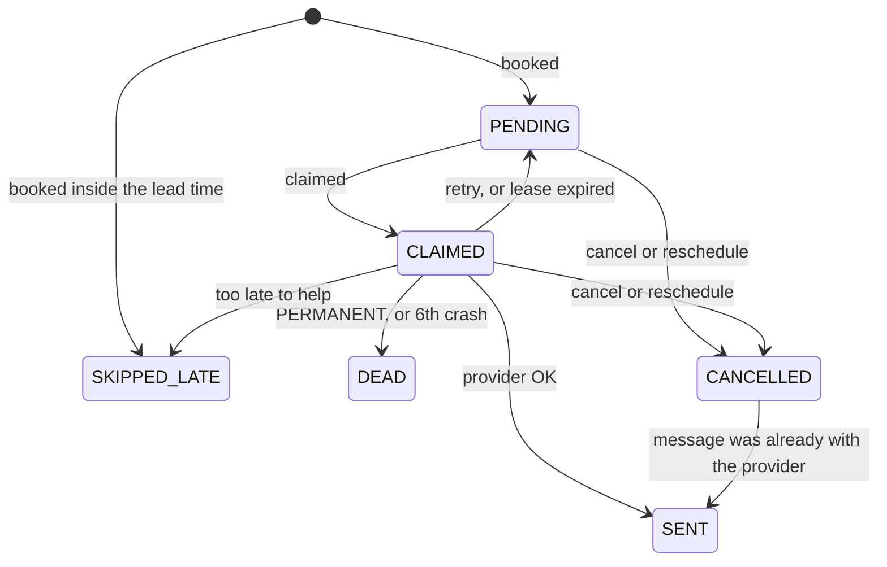

# Design decisions

What was decided, why, and what was rejected. Section references like §7.3 point into
[`SYSTEM_DESIGN.md`](../SYSTEM_DESIGN.md).

## Reminder lifecycle

Nothing ever leaves `SENT`.

## The queue is a table

Workers claim `reminder` rows with `SELECT … FOR UPDATE SKIP LOCKED`. Concurrent workers
get disjoint rows without blocking each other, so there is no leader, and adding a worker
adds throughput. Cancel and reschedule stay a plain `UPDATE`. Alternatives I rejected (§12):

- Kafka or RabbitMQ delayed messages. A message sitting in a 24-hour delay can't be
  retracted, and cancels and reschedules are routine. The workaround is a table of reminder
  state checked at consume time, which is this design plus a broker. SQS also caps delays
  at 15 minutes.
- Quartz. Its clustered mode serialises nodes through one lock row (`QRTZ_LOCKS`), so it
  contends hardest during the slot-boundary burst below, and it brings 11 tables.
- A Redis sorted set. Claims would be faster, but Redis would become a second source of
  truth for "was this sent", and any disagreement with Postgres is a duplicate or a miss.
- Computing due reminders from appointments on the fly. That leaves nowhere to record that
  a send happened, which is the whole requirement.

## Ten times the load is a burst problem

At 10× the brief (500,000 appointments a day), a Monday-morning peak is about 70 writes
per second. That is roughly 2% of one Postgres node, so there is no sharding, caching,
broker, or read replica here. §10.4 commits in advance to the thresholds that would justify
each one (sharding, for example, at 3,000 write TPS), so that decision isn't made in a panic.

Appointments are booked on the hour and half hour,
so about 31,000 24-hour reminders fall due in the same second. A worker sends its batch of
200 concurrently, so a batch costs its slowest send (about 0.2 s for SMS, 0.5 s for email)
instead of the sum. Three workers drain the burst in 60 to 80 seconds against a 5-minute
target. Sent one at a time, it would take 20 to 30 minutes.

The stub sender is what exposed that. It sleeps for a log-normal delay fitted to measured
provider acceptance times (Twilio p50 114 ms / p99 176 ms, SES p50 162 ms / p99 426 ms,
from [Knock's benchmarks](https://knock.app/sms-api-benchmarks/twilio)), so dispatcher
timing in tests matches what a real provider would do. The drain figures are arithmetic on
those latencies; measuring them with a load test is item 4 under
[With another week](../README.md#with-another-week).

Partial indexes (`WHERE status = 'PENDING'`, `WHERE status = 'CLAIMED'`) keep the claim a
scan from the left edge of a small index, however large the table grows.

## The network call sits between two transactions

Claim, send, settle. The claim commits before the send, and the settle is a second short
transaction after it. A provider that hangs for 30 seconds inside a transaction would hold
a pooled connection per send, and one batch would drain the pool the API shares. The lease
protects the row during the call instead. `SlowVendorTest` hangs 20 sends at once, twice
the pool size, and asserts there are zero `idle in transaction` connections and that the
database still answers.

Every settle is guarded by `WHERE status = 'CLAIMED' AND claimed_by = :workerId`. A worker
whose send outlived its lease has lost the row to the sweeper, so its late write matches
nothing. Without the guard, a late `RETRYABLE` could move a row that another worker had
already marked `SENT` back to `PENDING`, and it would go out again.

## One JAR, two roles, no ShedLock

`app.worker.enabled` turns the dispatcher on. API and worker nodes run the same artifact,
which is what lets an appointment and its reminders be written in one local transaction,
and they still scale separately.

The dispatcher has no ShedLock and must never get one. Every worker polls at once and
`SKIP LOCKED` gives each a different batch; a lock would leave all but one worker idle. The
lease sweeper runs on every worker too. It is idempotent, since a released row no longer
matches, and it uses `SKIP LOCKED` as well.

## Reminders are written with the appointment

Both reminder rows go into the booking's transaction, so an appointment can't exist without
them and no reconciliation job is needed. `failedReminderInsert_leavesNoAppointmentBehind`
makes the reminder insert fail and checks that the appointment rolled back with it.

A reminder that is already overdue at booking time is stored as `SKIPPED_LATE`. Book an
appointment 3 hours out and its 24-hour reminder is 21 hours late; stored as `PENDING` it
would fire at once and tell the customer their appointment is tomorrow. The row is kept, so
`GET /reminders` shows the skip.

## Time

- What is due is decided by Postgres `now()`. The claim compares `due_at <= now()` in SQL,
  and the app's `Clock` bean reads `SELECT now()`. Several workers means several clocks,
  and one running 4 minutes fast would send every reminder 4 minutes early.
- `due_at = scheduledAt.minus(lead)` on an `Instant`. That is 24 hours of elapsed time,
  correct across a DST change with no calendar code involved.
- `scheduledAt` must carry an offset, and it has to be an offset the dealership's zone
  uses at that local time. That rejects 02:30 on spring-forward night with a `422`,
  books 01:30 on fall-back night at whichever of the two instants the offset names, and
  rejects a client that sends `-06:00` all year for Chicago, which would otherwise book every
  summer appointment an hour late.
- The dealership's zone is copied onto the appointment. The message says "Tue 2:00 PM" in
  local time, and a dealership that changes its zone later doesn't move appointments that
  were already booked.

## When a late reminder is still worth sending

If the workers were down for three hours, should the overdue reminders go out? A fixed
grace period on `due_at` gets this wrong. The check measures the time left before the
appointment: a 24-hour reminder is useful until 2 hours before it (after that it arrives
alongside the 2-hour one), and a 2-hour reminder until 15 minutes before (after that the
customer is already on the way). A 24-hour reminder 4 hours late still goes out; a 2-hour
reminder 2 hours late is skipped. `DispatcherTest` asserts exactly that pair. The check runs
right before each send, after any wait for a send slot.

## Retries

| Provider answer | Examples | Result |
|---|---|---|
| `OK` | 2xx | `SENT` |
| `RETRYABLE` | timeout, 429, 5xx | `PENDING` again, due in `min(30 s · 2ⁿ, 15 min)` ± 20% jitter, on the database clock |
| `PERMANENT` | invalid number, unsubscribed | `DEAD` at once. Each retry would fail the same way |

A send that dies mid-flight, because the worker crashed or the send outlived its lease, is
requeued by the sweeper 60 to 90 seconds later. The sixth such death parks the reminder as
`DEAD` and logs an error. `RETRYABLE` answers don't count toward that cap: an outage ends,
and if they counted, every reminder due in roughly the first 15 minutes of a long outage
would be dropped. The useful-lead-time check bounds retries instead.

Each worker caps its in-flight sends per channel with a `Semaphore` (default 20), set to the
provider account's limit divided by the number of workers. Twilio answers `429` when an
account has too many concurrent requests. SES limits a rate, which a concurrency cap only
approximates; a rate limiter for email is the upgrade if SES starts throttling.

## Idempotent booking is part of "never twice"

A client that retries a `POST` after losing the response would otherwise create a second
appointment with its own pair of reminders. Every send would be unique, and the customer
would still get the 24-hour reminder twice. So `POST` requires an `Idempotency-Key`, backed
by `UNIQUE (dealership_id, idempotency_key)`:

- The same key with the same booking returns `200` and the original. Nothing is written.
- The same key with different details returns `409`. Returning the old booking would hide a
  client bug.
- Concurrent retries of one key: one insert wins, the others wait on the unique index and
  answer as replays (`ConcurrentBookingTest`).
- The replay lookup runs before the time checks, so a retry that arrives after the
  appointment time has passed still gets its booking back.

## Cancel and reschedule

Cancel moves `PENDING` and `CLAIMED` reminders to `CANCELLED` in one `UPDATE`. `SENT` rows
are left alone.

Reschedule takes `If-Match: <version>` and returns `409` on a stale version. Unsent
reminders are cancelled, and a new pair is written for the new time under the next
appointment version, through the same constructor as booking, so the short-notice rule
applies to both. A reminder that was already sent stays `SENT`, and the customer is reminded
again for the new time; I asked, and the client wants that. The version is part of the
unique key and of the idempotency key, so a deduplicating provider won't swallow the new
pair. Rescheduling to the same time is a no-op `200`. Rescheduling a cancelled appointment
is a `409`.

One race is accepted. If a cancel lands before the worker starts its send, the send is
stopped. If it lands while the message is already with the provider, the message arrives,
and the settle records `SENT` on the cancelled row so the record matches what the customer
received. Preventing that would take a transaction spanning an external call.

## Observability

`reminder_lag_seconds` is the age of the oldest reminder that should already have gone out.
A dead dispatcher, a slow database, a wedged provider, and too few workers all push it up,
so one alert at 300 seconds (the 5-minute target) covers failures nobody predicted. It is
registered on API nodes too, so it keeps reporting when every worker is down.

Alongside it: `reminder_send_seconds{type,channel,outcome}`, whose count is the send
counter, so the two can't disagree; `reminders_dead_total{reason}`, where only `crashes`
should page (`permanent` means a bad number); and `reminders_skipped_late_total`. The
liveness and readiness probes leave the database out on purpose, since a database outage
would otherwise pull every pod out of the load balancer at the same moment.

Recipients are masked in logs (`+1415•••0137`, `a•••@example.com`).

## Known limits

- The 8 KB body cap reads `Content-Length`, so a chunked body gets past it. The ingress
  proxy should enforce the cap as well.
- A sender call that never returns stalls that worker's poll loop and its sweeper, which
  share Spring's scheduler thread. A real provider adapter needs a timeout well under the
  60 s lease.
- The in-flight cap is per worker. It is set to the account limit divided by the worker
  count, so adding workers means lowering it.

The nightly duplicate check from §10.2 was cut from the code. It can't find a row while the
constraint exists, and the random-workload test runs the same query on every build.
